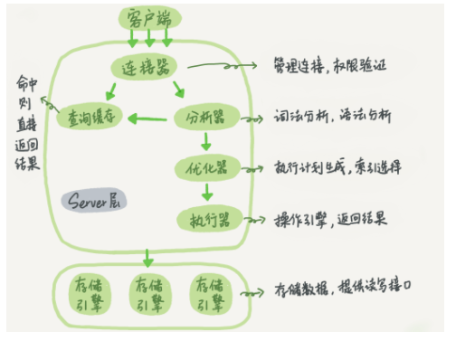

# MySQL

## 2.索引

### 2.1.MySQL索引是怎么实现的？B+树有哪些特点？为什么采用B+树？聚簇索引和非聚簇索引有什么区别？

**B+树的特点**

B+树是B-树的变体，也是一种多路搜索树，它与 B- 树的不同之处在于：

1. 所有数据存储在叶子节点出现，非叶子节点并不存储数据。
2. 每个叶子结点都存有相邻叶子结点的指针。

**为什么采用B+树而不是B树**

​		在计算机中，磁盘存储数据最小单元是扇区，一个扇区的大小是512字节，而文件系统（例如XFS/EXT4）的最小单元是块，一个块的大小是4k，而对于InnoDB存储引擎也有自己的最小储存单元，页（Page），一个页的大小是16K。索引中的一个节点代表着一个数据页，即一次磁盘I/O。

​		因为B树不管叶子节点还是非叶子节点，都会保存数据，这样导致在非叶子节点中能保存的指针数量变少，指针少的情况下要保存大量数据，只能增加树的高度，导致IO操作变多，查询性能变低（树高为3的B+树，可以存2000多万的数据而只需要3次磁盘I/O）。

**聚簇索引和非聚簇索引**

聚簇索引（主键索引）：节点页只包含了索引列，叶子页包含了行的全部数据。聚簇索引“就是表”，因此可以不需要独立的行存储。

非聚簇索引（普通索引）：叶子节点保存的不是指行的物理位置的指针，而是行的主键值，需要回表才能获取数据 。

### 2.2.哪些情况下需要建索引？解释下最左匹配原则？索引使用注意事项？

**建立索引的场景**

​		在经常需要搜索的列上；在经常用于连接两张表的列上；在经常需要根据范围进行搜索的列上创建索引；在经常需要排序的列上创建索引；在经常使用在WHERE子句中的列上。

**最左匹配原则**

​		在联合索引中，Mysql会优先匹配索引前缀（在创建联合索引时，查询最频繁的字段放前面）。

**覆盖索引**

​		如果一个索引包含所有需要的查询的字段的值，直接根据索引的查询结果返回数据，而无需回表，能够极大的提高查询性能。

**索引失效的场景**

1. 索引列存在函数或者运算
2.  != 或 not in或 <> 或or
3. 不满足最左匹配原则
4. like %XXXX
5. 类型转换（查询条件左右两侧类型不匹配的时候会发生隐式转换）
6. 包含NULL

## 4.调优

有没有sql调优经历。mysql的explain有用过吗？讲一讲数据库的慢查询？如何修改慢查询（最小成本更改），请你写一个分页的SQL语句？sql优化都有哪些?你们项目中用了哪?具体描述一下，Mysql中如何实现分页的,结合项目来写一个sql？Oracle中又是如何实现的,能否结合项目中用的来具体说明一下?你有哪些sql调优经验？MySQL慢查询的优化思路事务隔离级别，聚集锁非聚集锁（问到了一个非常细节的问题：如何用可重复读的隔离级别避免幻读）

### 4.1.explain执行计划看过没有？其中type字段都有哪些值？分别代表什么？

- id：表示查询中执行SELECT子句或操作表的顺序，当id相同时，从上 到下执行；当id不同时，数字越大越先执行。 
- select_type：select类型 
- table：表名 
- type（从上到下，性能越来越好） 
  - All：全表扫描 
  - index：全索引扫描，index与ALL区别为index类型只遍历索引树 
  - range：一定范围内的索引扫描（like right、between and、>、<） 
  - ref：查找非唯一性索引，返回匹配某一条件的多条数据。属于精确查找，数据返 回可能是多条 
  - eq_ref：查找唯一性索引，返回的数据至多一条，属于精确查找
  - const：查找主键索引，返回的数据至多一条，属于精确查找 
- key：显示MySQL实际决定使用的索引 
- rows：估算需要查询的行数

## 5.集群

### 5.1.数据库主从同步有延迟怎么办？

### 5.2.Mysql主从同步的实现原理?

### 5.3.什么是分库分表以及分库分表的具体方法和使用场景？用过哪些分库分表中间件？垂直拆分、水平拆分有用过吗？垂直和水平拆分如何设计动态扩容缩容的分库分库分表全局ID如何生成？

### 5.4.数据库分表查询如何定位？分库分表以后全局id怎么生成的？

## 6.日志

什么是刷脏页，

**redo log（重做日志）**

**作用**：确保事务的持久性。

**原理**：InnoDB特有，引擎在修改表的数据时,先更新内存并把修改记录写到redo log中，在适当的时候更新到磁盘中（先写日志，再写磁盘），因为redo log采用追加的方式，因此写日志的操作是磁盘上一小块区域内的顺序I/O,而不是随机I/O需要在磁盘的多个地方移动磁头，所以采用写日志的方式相对来说要快得多。

**bin log（二进制日志）**

**作用**：用于复制，在主从复制中，从库利用主库上的binlog进行重播；实现主从同步用于数据库的基于时间点的还原。

**undo log（回滚日志）**

**作用**：保证数据的原子性，保存了事务发生之前的数据的一个版本，用于回滚，同时可以提供多版本并发控制下的读（MVCC） 。

调优

## 7.存储引擎

mysql一条查询需要经过哪些组件，MySQL的存储引擎有哪些，有哪些区别？数据库innodb和myisam的区别（索引结构）Mysql的存储引擎了解吗?Innodb?MySQL 的存储引擎用的是什么?（InnoDB）为什么选 InnoDB?谈一下MySQL常见的两种存储引擎，适用场景------MyISAM和InnoDB的对比，MyISAM有meta-data统计行数（count *）不需要消耗多少资源。但InnoDB支持事务（提交、回滚）崩溃修复的安全机制。……性能上MyISAM更快，安全上InnoDB更安全，所以主从分离的情况下还需要给予实际业务的并发场景……
谈谈你对数据库索引的理解--------将无序数据整合成有序数据，保证查找的效率更快和维护的唯一性；mysql主要用到的索引有哈希索引和BTree索引……具体再阐述下内容。。。
如何保证缓存和数据库双写的一致性-----------------结合自己的工作经验公司项目中的处理措施，比如监听数据库变更，然后更新缓存……自己阐述。。。

存储引擎

- **InnoDB引擎**

InnoDB的数据存储在表空间中。

通过间隙锁策略防止幻读出现，不仅仅锁定查询设计的行，还会对索引中的间隙进行锁定，防止幻读行的插入。

- **MyISAM引擎**

不支持事务和行级锁，崩溃后无法安全恢复。

压缩表策略：压缩表可以极大地减少空间和磁盘I/O，对于不会更改的数据可以采用MyISAM引擎的压缩表。

一条SQL的执行过程

​		**每个客户端连接都会在服务器进程中拥有一个线程，这个连接的查询只会在这个单独的线程中执行**，该线程只能轮流在某个CPU中运行。服务器会负责缓存线程，因此不需要为每一个新建的连接创建或者销毁线程（用线程池中的少量线程来服务大量连接）。