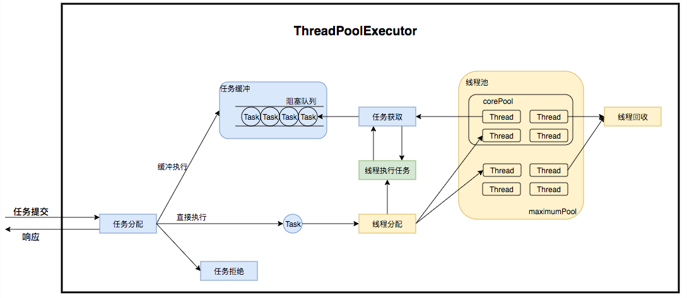
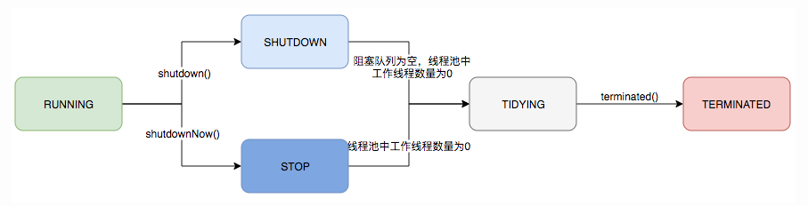
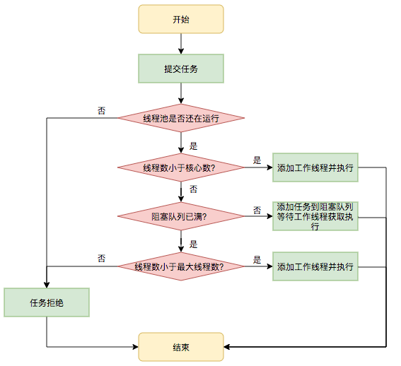

### 线程池

**原理**

线程池在内部实际上构建了一个生产者消费者模型，将线程和任务两者解耦，并不直接关联，从而良好的缓冲任务，复用线程。线程池的运行主要分成两部分：任务管理、线程管理。任务管理部分充当生产者的角色，当任务提交后，线程池会判断该任务后续的流转：

- 直接申请线程执行该任务；
- 缓冲到队列中等待线程执行；
- 拒绝该任务。

线程管理部分是消费者，它们被统一维护在线程池内，根据任务请求进行线程的分配，当线程执行完任务后则会继续获取新的任务去执行，最终当线程获取不到任务的时候，线程就会被回收。



**核心参数**

- int corePoolSize：核心线程数量
- int maximumPoolSize：最大线程数量
- long keepAliveTime：工作线程空闲时保持存活的时间
- BlockingQueue workQueue：阻塞队列
- RejectedExecutionHandler handle：拒绝策略

- int corePoolSize ：核心线程数量
- int maximumPoolSize：最大线程数量

**主要成员变量**

ctl 是状态控制变量，高 3 位存放线程池运行状态，底 29 位存放线程池工作线程数量，因此一个线程池在理论上最大的线程数是 （2 ^ 29） - 1。

```java
private final AtomicInteger ctl = new AtomicInteger(ctlOf(RUNNING, 0));
```

**线程池的生命周期**

- RUNNING（111）：能接受新提交的任务，也能执行阻塞队列的任务；
- SHUTDOWN（000）：不再接受新提交的任务，但是能执行阻塞队列的任务；
- STOP（001）：不再接受新提交的任务，也不处理阻塞队列的任务，并且会中断正在执行的任务；
- TIDYING（010）：所有的任务已终止，工作线程数为 0；
- TERMINATED（011）：停止状态。



**线程的生命周期**

线程池中线程的销毁依赖 JVM 自动的回收，线程池做的工作是根据当前线程池的状态维护一定数量的线程引用，防止这部分线程被 JVM 回收，当线程池决定哪些线程需要回收时，只需要将其引用消除即可。

**执行流程**



**主要方法**

- execute（提交任务并通过 addWorker 方法执行任务）

  ```java
  public void execute(Runnable command) {
      if (command == null)
          throw new NullPointerException();
      
      int c = ctl.get();
      //如果工作线程数小于核心线程数
      if (workerCountOf(c) < corePoolSize) {
          ////在addWorker中创建工作线程并执行任务
          if (addWorker(command, true))
              return;
          c = ctl.get();
      }
      //如果工作线程数大于等于核心线程数
      //线程池的状态是RUNNING，并且可以添加进队列
      if (isRunning(c) && workQueue.offer(command)) {
          int recheck = ctl.get();
          //如果线程池是不是处于RUNNING的状态，那么就会将任务从队列中移除
          if (! isRunning(recheck) && remove(command))
              //如果移除成功，执行拒绝策略
              reject(command);
          //如果移除失败，则会判断工作线程是否为0 ，如果过为0 就创建一个非核心线程
          else if (workerCountOf(recheck) == 0)
              addWorker(null, false);
      }
      //阻塞队列也满，且不能添加线程，则执行拒绝策略
      else if (!addWorker(command, false))
          reject(command);
  }
  ```

- addWorker（添加工作线程并执行任务）

  ```java
  //1.for循环判断是否能够添加线程，如果可以，使用cas来增加工作线程数量
  //2.启动线程执行任务
  private boolean addWorker(Runnable firstTask, boolean core) {
      retry:
      for (;;) {
          int c = ctl.get();
          int rs = runStateOf(c);
  
          //判断线程池的是否可以接收新任务
          if (rs >= SHUTDOWN &&
                  ! (rs == SHUTDOWN &&
                          firstTask == null &&
                          ! workQueue.isEmpty()))
              return false;
  
          for (;;) {
              int wc = workerCountOf(c);
              //判断工作线程的数量是否大于等于线程池的上限或者核心或者最大线程数
              if (wc >= CAPACITY ||
                      wc >= (core ? corePoolSize : maximumPoolSize))
                  return false;
              //使用cas增加工作线程数
              if (compareAndIncrementWorkerCount(c))
                  break retry;
              c = ctl.get();  // Re-read ctl
              //如果添加失败，并且线程池状态发生了改变，重来一遍
              if (runStateOf(c) != rs)
                  continue retry;
          }
      }
  
      boolean workerStarted = false;
      boolean workerAdded = false;
      Worker w = null;
      try {
          //新建worker
          w = new Worker(firstTask);
          // 获取当前线程
          final Thread t = w.thread;
          if (t != null) {
              final ReentrantLock mainLock = this.mainLock;
              mainLock.lock();
              try {
                  // Recheck while holding lock.
                  // Back out on ThreadFactory failure or if
                  // shut down before lock acquired.
                  int rs = runStateOf(ctl.get());
  
                  if (rs < SHUTDOWN ||
                          (rs == SHUTDOWN && firstTask == null)) {
                      //如果线程已经启动，抛出异常
                      if (t.isAlive()) 
                          throw new IllegalThreadStateException();
                      //workers是一个HashSet，必须在锁住的情况下操作
                      workers.add(w);
                      int s = workers.size();
                      if (s > largestPoolSize)
                          largestPoolSize = s;
                      workerAdded = true;
                  }
              } finally {
                  mainLock.unlock();
              }
              //如果添加成功，启动线程,执行Worker的run方法
              if (workerAdded) {
                  t.start();
                  workerStarted = true;
              }
          }
      } finally {
          //启动线程失败,回滚
          if (! workerStarted)
              addWorkerFailed(w);
      }
      return workerStarted;
  }
  ```

- runWorker

  1. while循环不断地通过 getTask 方法获取任务（在当前任务执行完毕后）；
  2. 跳出循环，执行 processWorkerExit 方法，销毁线程。

**线程池拒绝策略**

如果当前同时运行的线程数量达到最大线程数量并且队列也已经被放满了任务时采用拒绝策略：

- ThreadPoolExecutor.AbortPolicy：抛出 RejectedExecutionException 来拒绝新任务的处理；
- ThreadPoolExecutor.CallerRunsPolicy：直接调用 execute 方法的线程中运行被拒绝的任务；
- ThreadPoolExecutor.DiscardPolicy：不处理新任务，直接丢弃掉；
- ThreadPoolExecutor.DiscardOldestPolicy：此策略将丢弃最早的未处理的任务请求。

**其他常见的线程池**

- FixedThreadPool（可重用固定线程数的线程池，使用无界队列 LinkedBlockingQueue ，队列容量为 Integer.MAX_VALUE，当任务较多时会导致 OOM）
- SingleThreadExecutor（只有一个线程的线程池，也使用无界队列）
- CachedThreadPool（可缓存线程池）
- ScheduledThreadPoolExecutor（主要用来在给定的延迟后运行任务，或者定期执行任务）