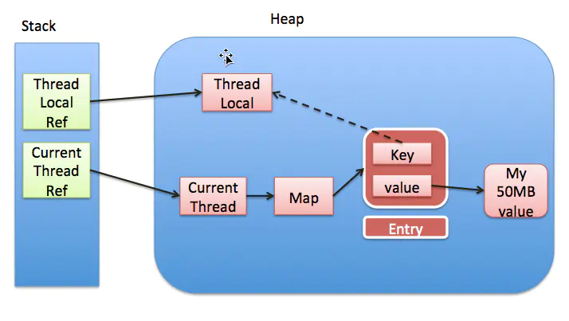
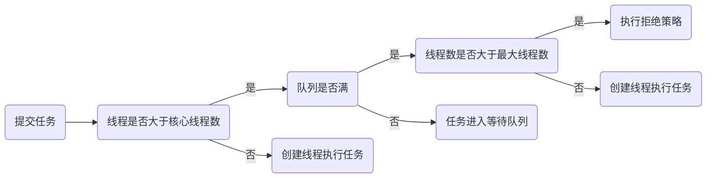
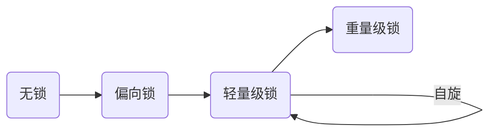

# Java

## 集合

- Collection
  - List （有序、可重复）
    - ArrayList （Object[]数组）

    - Vector （Object[]数组）：与 ArrayList 相似，但大部分方法用 Synchronized 修饰，线程安全。

    - LinkedList （双向链表）：维护了头尾两个 Node 节点， Node 节点包含了指向前后节点的两个引用，从而形成双向链表。
  - Set （无序、不可重复）
    - HashSet ：基于 HashMap 的 key 。
      - LinkedHashSet ：基于 LinkedHashMap 。
    - TreeSet ：基于 TreeMap 。
- Map
  - HashMap
    - LinkedHashMap ：维护了头尾两个 Node （该 Node 继承于`HashMap.Node`）节点， Node 节点包含了指向前后节点的两个引用，从而形成双向链表。
    - ConcurrentHashMap
  - TreeMap ：基于红黑树。

### ArrayList

**数据结构**

```java
transient Object[] elementData;
```

**成员变量**

```java
private static final int DEFAULT_CAPACITY = 10;//默认初始容量
```

**构造函数**

1. 数组通过该方法初始化后，size 等于 0，elementData 等于 {}，**在新增第一个元素时会进行扩容。**

   ```java
       public ArrayList() {
           this.elementData = DEFAULTCAPACITY_EMPTY_ELEMENTDATA;//{}
       }
   ```

2. 数组通过该方法初始化后，size 等于 0，elementData 长度等于 initialCapacity。

   ```java
       public ArrayList(int initialCapacity) {
           if (initialCapacity > 0) {
               this.elementData = new Object[initialCapacity];
           } else if (initialCapacity == 0) {
               this.elementData = EMPTY_ELEMENTDATA;
           } else {
               throw new IllegalArgumentException("Illegal Capacity: "+
                       initialCapacity);
           }
       }
   ```

**扩容机制**

1. 判断所需的最小容量是否大于内置数组长度；

2. 如果大于，则调用 `grow()` 方法进行扩容，新容量的大小为旧容量的1.5倍；

   > Q：为什么是1.5倍？
   >
   > A：扩容容量不能太小，防止频繁扩容，频繁申请内存空间和数组频繁复制；扩容容量不能太大，需要充分利用空间，避免浪费过多空间；1.5 可以充分利用移位操作，减少浮点数或者运算时间和运算次数。

3. 调用`Arrays.copyOf()`进行数据复制。

```java
    //minCapacity = size + 1
    private void ensureCapacityInternal(int minCapacity) {
        ensureExplicitCapacity(calculateCapacity(elementData, minCapacity));
    }
    //该方法返回的值>=10
    private static int calculateCapacity(Object[] elementData, int minCapacity) {
        //如果使用默认构造函数，则该方法返回10，否则返回minCapacity
        if (elementData == DEFAULTCAPACITY_EMPTY_ELEMENTDATA) {
            return Math.max(DEFAULT_CAPACITY, minCapacity);
        }
        return minCapacity;
    }
    //minCapacity一定>=10
    private void ensureExplicitCapacity(int minCapacity) {
        modCount++;
        //默认构造函数minCapacity = 10，elementData.length = 0
        if (minCapacity - elementData.length > 0)
            grow(minCapacity);
    }
    private void grow(int minCapacity) {
        int oldCapacity = elementData.length;
        int newCapacity = oldCapacity + (oldCapacity >> 1);
        if (newCapacity - minCapacity < 0)
            newCapacity = minCapacity;
        if (newCapacity - MAX_ARRAY_SIZE > 0)
            newCapacity = hugeCapacity(minCapacity);
        elementData = Arrays.copyOf(elementData, newCapacity);
    }
```

**add方法**

- 1. 判断是否需要扩容；
  2. 赋值。

  ```java
  public boolean add(E e) {
      ensureCapacityInternal(size + 1);
      elementData[size++] = e;
      return true;
  }
  ```

- 1. 判断是否需要扩容；
  2. 调用`System.arraycopy`将目标位置及之后的元素复制；
  3. 赋值。

  ```java
    public void add(int index, E element) {
        rangeCheckForAdd(index);
        ensureCapacityInternal(size + 1);
        System.arraycopy(elementData, index, elementData, index + 1,
                size - index);
        elementData[index] = element;
        size++;
    }
  ```


### ConcurrentHashMap

**数据结构**

```java
//基于Node节点的数组和链表/红黑树
transient volatile Node<K,V>[] table;

static class Node<K,V> implements Map.Entry<K,V> {
    final int hash;
    final K key;
    volatile V val;
    volatile ConcurrentHashMap.Node<K,V> next;
}
```

**成员变量**

```java
//用于数组初始化与扩容控制
//-1：table正在初始化
//-N：表示有N-1个线程正在进行扩容操作
//0：未指定初始容量
//>0：容量
private transient volatile int sizeCtl;
```

### HashMap

**数据结构**

```java
//基于Node节点的数组和链表/红黑树
transient Node<K,V>[] table;

static class Node<K,V> implements Map.Entry<K,V> {
    //用来定位数组索引位置
    final int hash;
    final K key;
    V value;
    //链表的下一个node
    HashMap.Node<K,V> next;
}
```

**成员变量**

```java
static final int DEFAULT_INITIAL_CAPACITY = 1 << 4;//默认初始容量16
static final int TREEIFY_THRESHOLD = 8;//链表转换成红黑树的临界值
static final int MIN_TREEIFY_CAPACITY = 64;//链表转换成红黑树的最低容量
static final int UNTREEIFY_THRESHOLD = 6//红黑树转换成链表的临界值
final float loadFactor;//负载因子
static final float DEFAULT_LOAD_FACTOR = 0.75f;//默认负载因子；元素达到3/4扩容
int threshold;//扩容的阈值
```

> Q：为什么默认负载因子是0.75？
>
> A：0.75符合泊松分布，如果负载因子为1，那么在出现大量的hash膨胀的情况下，元素会较密集，并且都是用链表或者红黑树的方式连接，导致查询效率较低。 若负载因子为0.5那么就会造成空间的浪费，元素分布较为稀疏。

**构造函数**

1. ```java
   public HashMap() {
           this.loadFactor = DEFAULT_LOAD_FACTOR; //0.75
       }
   ```

2. 该构造函数会根据参数计算扩容的阈值。

   ```java
   public HashMap(int initialCapacity) {
           this(initialCapacity, DEFAULT_LOAD_FACTOR);
       }
   ```

3. 该构造函数会根据参数计算扩容的阈值。

   ```java
       public HashMap(int initialCapacity, float loadFactor) {
               if (initialCapacity < 0)
                   throw new IllegalArgumentException("Illegal initial capacity: " + initialCapacity);
               if (initialCapacity > MAXIMUM_CAPACITY)
                   initialCapacity = MAXIMUM_CAPACITY;
               if (loadFactor <= 0 || Float.isNaN(loadFactor))
                   throw new IllegalArgumentException("Illegal load factor: " +
                           loadFactor);
               this.loadFactor = loadFactor;
               //返回大于输入参数且最近的2的整数次幂的数
               this.threshold = tableSizeFor(initialCapacity);
           }
   ```

**hash运算**

```java
    static final int hash(Object key) {
        int h;
        // hashCode低位异或高位
        return (key == null) ? 0 : (h = key.hashCode()) ^ (h >>> 16);
    }
```

> Q：为什么要高位参与运算？
>
> A：混合原始哈希码的高位和低位，以此来加大低位的随机性，后面的取模运算只有hash变量的末x位会参与到运算，使高16位也参与到hash的运算能减少冲突。

**取模运算**

​		通过该计算公式确定元素在*bucket*位置的下标。

```java
    static int indexFor(int h, int length) {
         return h & (length - 1);
    }
```

> Q：为什么HashMap的size是2的n次方？
>
> A：取模运算（`hash%length`）可以保证计算后的索引值不会超过数组的长度，而当`tab.length`总是2的n次方时，对`tab.length `取模等价于`(tab.length - 1) & hash`运算，而二进制位运算`&`比十进制`%`具有更高的效率。

**get方法**

1. 通过***hash*运算和取模运算**确定该元素的*bucket*位置；
2. 如果该位置有元素且元素的*hash*和*key*都相同，则返回该值，如果不相同：
   1. 如果该节点是树，则通过`getTreeNode()`方法处理；
   2. 如果不是树，则遍历该链表。

**put方法**

1. 判断*table*是否为空，如果为空则扩容；
2. 通过***hash*运算和取模运算**确定*bucket*位置；
3. 如果该*bucket*位置没有元素，则直接插入，如果存在元素：
   1. 如果该元素的*hash*和*key*都相同，则直接覆盖*value*，如果不相同：
      1. 如果节点是树则通过`putTreeVal()`插入键值对；
      2. 如果是链表，则遍历链表，如果遍历到的链表位置下个节点是空，则直接插入并判断是否需要转换成红黑树；如果节点元素的*hash*和*key*都相同，则直接覆盖*value*；
4. 判断是否超过阈值，超过阈值则扩容。

**扩容机制**

1. 扩容（计算新容量和新阈值）
   1. 如果旧容量大于0：
      1. 旧容量超过最大值则不再扩容；
      2. 否则新容量和新阈值扩大为旧容量和旧阈值的两倍；
   2. 如果旧容量等于0且旧阈值大于0，则新容量等于旧阈值，新阈值等于新容量乘负载因子；
   3. 如果旧容量和旧阈值都等于0，则新容量等于默认值，新阈值等于新容量乘负载因子；
2. rehash（复制元素）
   1. 遍历旧数组，如果旧槽位置的元素没有链表/红黑树，则重新计算槽位置并再新数组中插入键值对；
   2. 如果是树则使用红黑树的方法插入键值对；
   3. 如果是链表，则创建新旧两个链表，如果元素的hash`&`旧容量是否等于0则把元素存放到旧链表中，否则存放到新链表，然后在新table中插入两个链表，（旧链表位置不变，新链表位置为旧索引+旧容量的位置）。

## 并发

### 多线程

#### 多线程常用方法

**wait()**

属于 Object 类的实例方法**，**必须在 synchronized 语句块内使用（需要获取对象锁）**，**当调用某一对象的 wait() 方法后，会使当前线程暂停执行并释放对象锁，然后将当前线程放入对象等待池中（等待池中的线程不会竞争对象锁）。

**notify()/notifyAll()**

属于 Object 类的实例方法，必须在 synchronized 语句块内使用，当有线程调用了对象的 notify()/notifyAll() 方法，被唤醒的的线程便会从等待池进入该对象的锁池中，锁池中的线程会去竞争该对象锁（notify() 随机唤醒一个调用 wait() 的线程，notifyAll() 唤醒所有调用 wait() 线程）。

**sleep()**

属于Thread类的静态方法，使当前正在执行的线程暂停执行并进入阻塞状态，当指定的时间到了又会自动恢复就绪状态。不会释放锁**，**不考虑线程优先级（会给低优先级的线程运行的机会）。

**yield()**
与 sleep() 方法类似，区别在于它没有参数（即使用 yield() 方法的线程立刻进入就绪状态，有可能马上又被执行）和只能使同优先级或者高优先级的线程得到执行机会。

**join()**

属于Thread类的实例方法，将指定的线程加入到当前线程，可以将两个交替执行的线程合并为顺序执行的线程，比如在线程B中调用了线程A的 Join() 方法，直到线程A执行完毕后，才会继续执行线程B。

**start()**

当线程调用 start() 后，线程会被放到等待队列等待 CPU 调度，并不一定马上开始执行，只是将这个线程置于就绪状态。

**run()**

当线程得到 CPU 时间片，才会调用 run() 方法，执行线程的任务。

#### 多线程打印问题

启动两个线程，一个输出 1，3，5，6....99 ，另一个输出 2，4，6，8....100 最后按序输出 1，2，3，4，5，6...100 ？如果用 java 的 wait 和 notify 机制如何实现？

```java
    private static int i = 1;

    public static void main(String[] args) {
        final Object o = new Object();
        Thread t1 = new Thread(() -> {
            while (i < 100) {
                synchronized (o) {
                    if (i % 2 == 0) {
                        System.out.println(i++);
                    }
                }
            }
        });
        Thread t2 = new Thread(() -> {
            while (i < 100) {
                synchronized (o) {
                    if (i % 2 == 1) {
                        System.out.println(i++);
                    }
                }
            }
        });
        t1.start();
        t2.start();
    }
```

**java 的 wait 和 notify 机制实现**

```java
    private static int i = 1;
    private static final Object o = new Object();

    public static void main(String[] args) {
        new Thread(new MyThread()).start();
        new Thread(new MyThread()).start();
    }

    static class MyThread implements Runnable {

        @Override
        public void run() {
            while (i <= 100) {
                synchronized (o) {
                    System.out.println(i++);
                    try {
                        object.notify();
                        object.wait();
                    } catch (InterruptedException e) {
                        e.printStackTrace();
                    }
                }
            }
        }
    }
```

### 锁

- 线程同步要不要锁住资源？
  - 锁住----------**悲观锁**
  - 不锁住----------**乐观锁**
- 锁住同步资源线程要不要阻塞？
  - 阻塞
  - 不阻塞----------**自旋锁/适应性自旋锁**
- 多个线程竞争同步资源的流程细节有没有区别？
  - 同一个线程执行同步资源时自动获取资源----------**偏向锁**
  - 多个线程竞争同步资源时，没有获取资源的线程自旋等待锁释放----------**轻量级锁**
  - 多个线程竞争同步资源时，没有获取资源的线程阻塞等待唤醒----------**重量级锁**
- 多个线程竞争锁时要不要排队？
  - 排队----------**公平锁**
  - 先尝试插队，插队失败再排队----------**非公平锁**
- 一个线程中的多个流程能不能获取同一把锁？
  - 能----------**可重入锁**
  - 不能----------**非可重入锁**
- 多个线程能不能共享一把锁
  - 能----------**共享锁**
  - 不能----------**排它锁**

### ThreadLocal

**作用**

​		主要是做数据隔离，填充的数据只属于当前线程，对别的线程而言是相对隔离的，在多线程环境下，可以防止自己的变量被其它线程篡改。

**原理**

​		线程通过 ThreadLocal 把需要隔离的数据存在自己线程（Thread）的 ThreadLocalMap 成员变量中。

**内存泄露问题**

```java
    static class ThreadLocalMap {

        static class Entry extends WeakReference<ThreadLocal<?>> {

            Object value;

            Entry(ThreadLocal<?> k, Object v) {
                super(k);
                value = v;
            }
        }
    }
```



ThreadLocalMap 使用 ThreadLocal 的弱引用作为 key（虚线为弱引用），如果一个 ThreadLocal 不存在外部强引用时， ThreadLocal 会被 GC 回收，这样就会导致 ThreadLocalMap 中 key 为 null，而 value 还存在着强引用（value 无法被访问到），只有 thread 线程退出以后，value的强引用链条才会断掉。但如果当前线程再迟迟不结束（线程池），这些 value 永远无法回收，从而造成内存泄漏。

> 为什么不用 key 强引用？
>
> key 如果是强引用的话，即使 ThreadLocal 引用置为 null，也不会被回收，出现逻辑错误。

解决办法：每次使用完 ThreadLocal 都调用 remove() 方法清除数据。

> 实际上set，get，remove 方法都有内置清理掉 key 为 null 的脏 entry 的方法 。

### Volatile

**原理**

​		在字节码加 lock 前缀，将本处理器的缓存写入了内存（意味着所有之前的操作都已经执行完成，形成了“指令重排序无法越过内存屏障”的效果），该写入动作也会引起别的处理器或者别的内核无效化其缓存，这种操作相当于对缓存中的变量做了“store和 write”操作。所以通过这样一个空操作，可让前面 volatile 变量的修改对其他处理器立即可见。

**特性**

- 可见性 

- 禁止指令重排序 


> volatile不能保证原子性（多个线程同时i++不能保证结果正确）

**与 Synchronized 的区别**

1. volatile 只能修饰变量，synchronized 可以修饰方法以及代码块；
2. 多线程访问 volatile 不会发生阻塞，而 synchronized 会出现阻塞；
3. 关键字 volatile 解决的是多线程之间的可见性问题，而 synchronized 解决的是多线程之间资源同步问题。

### 线程池

**原理**

线线程池内部使用一个变量维护两个值：运行状态（runState）和有效线程数量 （workerCount）。在具体实现中，线程池将运行状态（runState）、线程数量 （workerCount）两个关键参数的维护放在了一起，高 3 位保存 runState，低 29 位保存 workerCount。

```java
private final AtomicInteger ctl = new AtomicInteger(ctlOf(RUNNING, 0));
```

**流程**



**初始化线程池的参数**

1. corePoolSize：核心线程数，线程池最小可以同时运行的线程数量（CPU 密集型设定为核心数 + 1，IO 密集型设定为核心数 * 2）。
2. maximumPoolSize：线程池的最大线程数，当队列中存放的任务达到队列容量的时候，当前可以同时运行的线程数量变为最大线程数。
3. keepAliveTime：当线程池中的线程数量大于 corePoolSize 的时候，如果这时没有新的任务提交，核心线程外的线程不会立即销毁，而是会等待，直到等待的时间超过了 keepAliveTime 才会被回收销毁；
4. BlockingQueue<Runnable> workQueue：任务队列，用来储存等待执行任务的队列，当新任务来的时候会先判断当前运行的线程数量是否达到核心线程数，如果达到的话，新任务就会被存放在队列中。
5. TimeUnit unit：keepAliveTime 参数的时间单位。
6. ThreadFactory threadFactory：线程工厂，用来创建线程，一般默认即可
7. RejectedExecutionHandler handler：拒绝策略，当提交的任务过多而不能及时处理时，我们可以定制策略来处理任务。

**拒绝策略**

- ThreadPoolExecutor.AbortPolicy：默认拒绝策略，丢弃任务并抛出异常。
- ThreadPoolExecutor.DiscardPolicy：丢弃任务但不抛出异常。
- ThreadPoolExecutor.DiscardOldestPolicy：丢弃队列最前面的任务，然后重新提交被拒绝的任务。
- ThreadPoolExecutor.CallerRunsPolicy：由调用线程（提交任务的线程）处理该任务。

### Synchronized

Java 把锁的相关信息存储在对象头的 Mark Word，通过操作 Mark Word 实现锁的升级过程。




**偏向锁**

当线程请求到锁对象后，先检查 MarkWord  的线程 id，如果为空则通过 CAS 设置为当前线程 id；如果不为空则检查线程 id 是否为本线程，如果是本线程则直接进入同步块，如果不是表示有第二条线程竞争，则升级成轻量级锁。

**轻量级锁**

​		当线程请求锁时，JVM 会在该线程的栈帧中创建一块名为“锁记录”的空间，然后将锁对象的 Mark Word 拷贝至该空间，最后通过CAS 操作将锁对象的 Mark Word 替换为指向该锁记录的指针，如果操作成功则获得锁，如果失败则先检查对象的 Mark Word 是否指向当前线程的栈帧，如果是则说明已经获取锁，否则说明其它线程竞争锁那么进入自旋，当自旋一定次数后还未获得锁则膨胀为重量级锁。

**自旋**

竞争锁的线程不会阻塞挂起（避免线程唤醒的开销），而是通过自旋（继续持有 CPU 执行权等待一段时间）来尝试获取锁，自旋的次数不固定，而是由前一次在同一个锁上的自旋时间及锁的拥有者的状态来决定。（自旋需要消耗CPU）

**重量级锁**

Java 通过 Monitor（管程，线程互斥访问共享资源的一种同步机制）来实现重量级锁（管程在 java 中的重量级锁的实现类）。

```c
ObjectMonitor() {
    _header       = NULL;
    _count        = 0;
    _waiters      = 0,       // 等待中的线程数
    _recursions   = 0;       // 线程重入次数
    _object       = NULL;    // 存储该 monitor 的对象
    _owner        = NULL;    // 指向拥有该 monitor 的线程
    _WaitSet      = NULL;    // 等待线程 双向循环链表_WaitSet 指向第一个节点
    _WaitSetLock  = 0 ;
    _Responsible  = NULL ;
    _succ         = NULL ;
    _cxq          = NULL ;   // 多线程竞争锁时的单向链表
    FreeNext      = NULL ;
    _EntryList    = NULL ;   // _owner 从该双向循环链表中唤醒线程，
    _SpinFreq     = 0 ;
    _SpinClock    = 0 ;
    OwnerIsThread = 0 ;
    _previous_owner_tid = 0; // 前一个拥有此监视器的线程 ID
  }
```


1. 通过 CAS 尝试把 monitor 的 owner 字段设置为当前线程；
2. 如果设置之前的 owner 指向当前线程，说明当前线程再次进入 monitor，即重入锁执行 recursions ++ , 记录重入的次数；
3. 如果当前线程是第一次进入该 monitor，设置 recursions 为 1，_owner 为当前线程，该线程成功获得锁并返回；
4. 如果获取锁失败，则等待锁的释放。

### AQS

**原理**

通过内部维护的 state 同步状态和一个 FIFO 等待队列来实现同步功能，本质是多个线程竞争 state。

- 当 state 为 0 时，表示没有任何线程持有锁，不为 0 时代表锁已被占用，线程会被放入到一个FIFO的等待队列中。
- 当有线程持有该锁时，值就会在原来的基础上+1，同一个线程多次获得锁，就会多次+1（可重入）。
- 解锁是对这个字段 -1，一直到 0，此线程对锁释放。

**数据结构**

由头尾两个 Node 节点且节点包含了指向前驱和后继的指针组成的虚拟双向队列（FIFO）和 state 同步状态组成。

```java
private transient volatile Node head;//无参构造函数的头结点，并不存储任何信息，只是占位。

private transient volatile Node tail;

private volatile int state;//同步状态

static final class Node {

    volatile int waitStatus;//当前节点在队列中的状态

    volatile Node prev;

    volatile Node next;

    volatile Thread thread;//当前节点的线程

    Node nextWaiter;
}
```

### ReenterLock

**原理**

基于 AQS 实现锁机制。

**加锁过程**

1. 通过 reentrantlock.lock() 加锁；
2. 根据公平锁/非公平锁调用各自的 sync.lock() 的实现方法，公平锁直接调用 AQS.aquire() 方法，非公平锁先通过 CAS 设置 state ，成功则将当前线程设置为独占线程（获得锁），失败则调用 AQS.aquire() 方法（非公平锁多一步插队的过程）；
3. 根据公平锁/非公平锁调用各自的 tryAcquire() 的实现方法：如果 state 为 0 则将当前线程设置为独占线程（获得锁），如果 state 不为 0 ，但是独占线程为当前线程（重入），则将 state 加 1 ，否则表示加锁失败；
4. 如果 tryAcquire() 获取锁失败，则调用 AQS.aquire() 方法的 addWaiter() 将线程加入到等待队列的末尾，并通过 acquireQueued() 方法把放入队列中的线程不断尝试去获取锁（自旋），直到获取成功或者中断线程。

**解锁过程**

1. 通过 reentrantlock.unlock() 加锁；
2. 调用 AQS.release() 方法；
3. 调用 sync 中的 AQS.tryRelease() 的实现方法：如果当前线程不是独占线程抛出异常，否则 state 减 1，如果 state 变为 0 表示没有线程持有锁；
4. 如果第二步没有线程持有锁，执行 AQS.release() 方法后面的代码块判断是否需要解除阻塞挂起的线程。

**与 Synchronized 的异同**

|            | ReentrantLock                  | Synchronized     |
| ---------- | ------------------------------ | ---------------- |
| 锁实现机制 | AQS                            | 监视器模式       |
| 灵活性     | 支持响应中断、超时、尝试获取锁 | 不灵活           |
| 释放形式   | 必须显式调用 unlock() 释放锁   | 自动释放监视器   |
| 条件队列   | 可关联多个条件队列             | 关联一个条件队列 |
| 可重入性   | 可重入                         | 可重入           |
| 锁类型     | 公平锁 & 非公平锁              | 非公平锁         |

# 设计模式

## 单例模式

**饿汉式**

```java
public class Singleton {

    private static final Singleton singleton = new Singleton();

    private Singleton() {}

    public static Singleton getInstance() {
        return singleton;
    }
}
```

**双重锁懒汉式**

```java
public class Singleton {

    private static volatile Singleton singleton;

    private Singleton() {
    }

    public static Singleton getInstance() {
        if (singleton == null) {
            synchronized (Singleton.class) {
                if (singleton == null) {
                    singleton = new Singleton();
                }
            }
        }
        return singleton;
    }
}
```

**holder式**

```java
public class Holder {

    private Holder() {
    }

    public static Holder getInstance() {
        return InnerClass.HOLDER;
    }

    //在主类调用时才会加载
    public static class InnerClass {
        private static final Holder HOLDER = new Holder();
    }
}
```

**静态内部类式和双重锁懒汉式的区别**

1. 双重锁懒汉式的双锁降低了程序响应速度和性能。
2. 静态内部类保证了内部类不会被反射，更加安全。

# Redis

## 分布式锁

**实现方式**

Redis 锁主要利用 Redis 的 SETNX 命令：

- 加锁命令：SETNX key value，当 key 不存在时，对 key 设置指定的值，设置成功返回 1，设置失败返回 0 。 key 是锁的唯一标识，一般按业务来决定命名。
- 解锁命令：DEL key，通过删除键值对释放锁，以便其他线程可以通过 SETNX 命令来获取锁。
- 锁超时：EXPIRE key timeout, 设置 key 的超时时间，以保证即使锁没有被显式释放，锁也可以在一定时间后自动释放，避免资源被永远锁住。

则加锁解锁伪代码如下：

```java
if (setnx(key, 1) == 1){
    expire(key, 30)
    try {
        //TODO 业务逻辑
    } finally {
        del(key)
    }
}
```

**常见问题**

1. 上锁后由于服务器挂掉、重启或网络问题等没有执行超时命令，导致变成死锁。（使用Lua脚本解决）
2. 执行时间超过锁超时时间。（增加线程监听锁，当代码未执行完时延长锁超时时间）
3. 不可重入。（使用 Redis Map 数据结构来实现存锁的标识和重入次数）

## 布隆过滤器

**应用场景**

网页 URL 去重、垃圾邮件识别、大集合中判断元素是否存在和缓存穿透等问题。

**数据结构/原理**

布隆过滤器右位一串很长的仅包含0、1的位向量组成（默认为0）。当添加元素时，通过 n 个不同的哈希函数求得不同的值并将结果位置上对应位的值置为 “1”。（如果值已经为 “1” 则覆盖，如果所有计算的值都为 “1” 则表示存在该元素）。

**实现方法**

Redis 实现布隆过滤器的底层是通过 bitmap 数据结构。

## 缓存雪崩、缓存穿透、缓存击穿

### 缓存击穿

​		某个热点 key 在某个时间点过期的时候，而恰好在这个时间点对这个 Key 有大量的并发请求来，导致所有请求都打到数据库上。

**解决方法**

- 永不过期；
- 互斥锁（ SETNX ）。

### 缓存雪崩

​		缓存在同一时间大面积的失效，后面的请求都直接落到了数据库上，造成数据库短时间内承受大量请求。

**解决方法**

​		不同的 key 失效时间加上一个随机因子，尽可能分散缓存过期时间。

### 缓存穿透

​		大量请求缓存查不到的 key ，导致所有请求越过缓存直接查询数据库。

**解决方法**

- 布隆过滤器；
- key 校验；
- 缓存这个不存在的 key （如果从数据库查询的对象为空，也放入缓存，只是设定的缓存过期时间较短，比如设置为 60 秒）。

**三者的区别**

缓存击穿和缓存雪崩是 key 过期的问题（缓存击穿是一个热点 key 过期，缓存雪崩是很多 key 同时过期）；缓存穿透是查询到不存在的 key 。