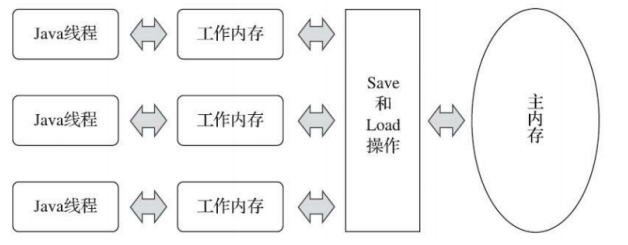

# Java并发

## Java内存模型[[TOP]](#Java并发)

​		Java内存模型规定了所有的变量都存储在主内存（Main Memory）中。每条线程还有自己的工作内存（Working Memory，与CPU的处理器高速缓存类比），线程的工作内存中保存了被该线程使用的变量的主内存副本，线程对变量的所有操作（读取、赋值等）都必 须在工作内 存中进行，而不能直接读写主内存中的数据。不同的线程之间也无法直接访问 对方工作内存中的变 量，线程间变量值的传递均需要通过主内存来完成。

**内存间交互操作**

关于主内存与工作内存之间具体的交互协议（即一个变量如何从主内存拷贝到工作内存、如何从工作内存同步回主内存这一类的实现细节），Java内存模型中定义了以下8种操作来完成： 

- lock（锁定）：作用于主内存的变量，它把一个变量标识为一条线程独占的 状态。
- unlock（解锁）：作用于主内存的变量，它把一个处于锁定状态的变量释放出来，释放后的变量才可以被其他线程锁定。
- read（读取）：作用于主内存的变量，它把一个变量的值从主内存传输到线程的工作内存中，以便随后的load动作使用。 
- load（载入）：作用于工作内存的变量，它把read操作从主内存中得到的变量值放入工作内存的变量副本中。
- use（使用）：作用于工作内存的变量，它把工作内存中一个变量的值传递给执行引擎，每当虚拟机遇到一个需要使用变量的值的字节码指令时将会执行这个操 作。 
- assign（赋值）：作用于工作内存的变量，它把一个从执行引擎接收的值赋给工作内存的变量，每当虚拟机遇到一个给变量赋值的字节码指令时执行这个操作。
- store（存储）：作用于工作内存的变量，它把工作内存中一个变量的值传送到主内存中，以便随后的write操作使用。 
- write（写入）：作用于主内存的变量，它把store操作从工作内存中得到的变量的值放入主内存的变量中。

**原子性**

​		由Java内存模型来直接保证的原子性变量操作包括read、load、assign、use、store 和write这六个。 Java内存模型还提供了lock和 unlock操作来满足这种需求，尽管虚拟机未把lock和 unlock操作直接开放给用户使用，但是却提供了更高层次的字节码指令monitor.enter和 monitor.exit来隐式地使用这两个操作。这两个字节码指令反映到Java 代码中就是同步块 ——synchronized关键字，因此在synchronized块之间的操作也具备原子性。 

**可见性** 

​		Java内存模型是通过在变量修改后将新值同步回主内存，在变量读取前从主内存刷新变量值这种依赖主内存作为传递媒介的方式来实现可见性的。 

**有序性**

