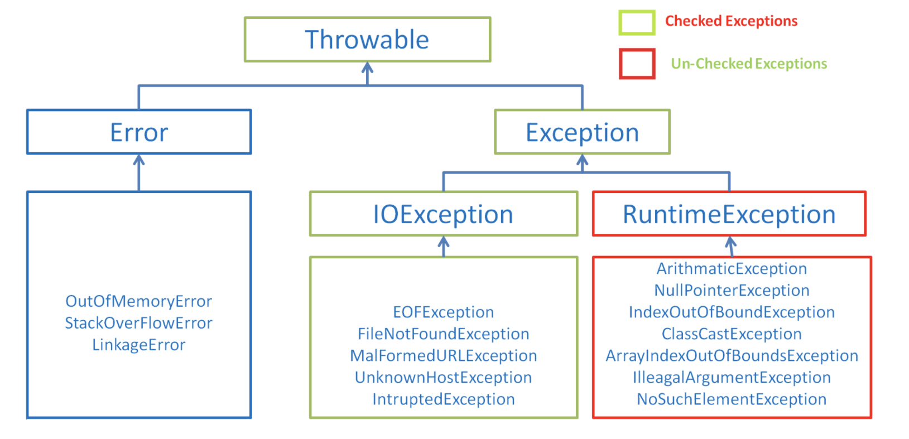

# Java基础[[index]](https://github.com/Linkhhh/notes)

- [1. 基本数据类型](#1-基本数据类型TOP)
  - [1.1. Java基本数据类型有哪些？](#11-Java基本数据类型有哪些TOP)
  - [1.2. 什么是装箱和拆箱？](#12-什么是装箱和拆箱TOP)
- [2. Object类](#2-Object类TOP)
  - [2.1. Object 类有哪些常用的方法？](#21-Object 类有哪些常用的方法TOP)
  - [2.2. 哪些场景下子类需要重写 equals 方法和 hashCode 方法？](#22-哪些场景下子类需要重写 equals 方法和 hashCode 方法TOP)
  - [2.3. 为什么重写equals方法一定要重写hashCode？](#23-为什么重写equals方法一定要重写hashCodeTOP)
- [3. java的String类型为什么是不可变的？](#3-java的String类型为什么是不可变的TOP)
- [4. 异常](#4-异常TOP)
  - [4.1. Error与Exception有什么区别？](#41-Error与Exception有什么区别TOP)
  - [4.2. UnCheckedExceptions和CheckedExceptions的区别？](#42-UnCheckedExceptions和CheckedExceptions的区别TOP)
  - [4.3. 列举几个了常见的运行时异常？](43-列举几个了常见的运行时异常TOP)
- [5. 反射](#5-反射TOP)
  - [5.1. 怎么通过反射创建类实例？](#51-怎么通过反射创建类实例TOP)
  - [5.2. 反射机制有哪些优点和缺点？](#52-反射机制有哪些优点和缺点TOP)
  - [5.3. 反射能获取到父类的私有方法吗？](#53-反射能获取到父类的私有方法吗TOP)
- [6. JDK动态代理和CgLib动态代理是怎么实现的？有什么区别？](#6-JDK动态代理和CgLib动态代理是怎么实现的有什么区别TOP)
- [7. 什么是序列化和反序列化？java底层是怎么实现？](#7-什么是序列化和反序列化java底层是怎么实现TOP)
- [8. 什么是值传递和引用传递？](#8-什么是值传递和引用传递TOP)

## 1. 基本数据类型[[TOP]](#Java基础)

### 1.1. Java基本数据类型有哪些？[TOP]](#Java基础)

| 基本类型 | 大小          | 范围                   |
| -------- | ------------- | ---------------------- |
| boolean  | /             | /                      |
| byte     | 1字节（byte） | -128~127               |
| short    | 2字节         | -2^15~2^15-1           |
| char     | 2字节         | Unicode0~Unicode2^16-1 |
| int      | 4字节         | -2^31~2^31-1           |
| float    | 4字节         | IEEE754                |
| double   | 8字节         | IEEE754                |
| long     | 8字节         | -2^63~2^63-1           |

### 1.2. 什么是装箱和拆箱？[[TOP]](#Java基础)

**装箱**：将基本类型用它们对应的引用类型包装起来；

**拆箱**：将包装类型转换为基本数据类型；

​		Java 基本类型的包装类的大部分都实现了常量池技术，即 Byte,Short,Integer,Long,Character,Boolean；前面 4 种包装类默认创建了数值[-128，127] 的相应类型的缓存数据，Character 创建了数值在[0,127]范围的缓存数据，Boolean 直接返回 True Or False。如果超出对应范围仍然会去创建新的对象。**两种浮点数类型的包装类 Float,Double 并没有实现常量池技术。**

## 2. Object类[[TOP]](#Java基础)

### 2.1. Object 类有哪些常用的方法？[[TOP]](#Java基础)

**equals**

​		该方法用于比较两个对象；在 Object类 中`equals`和==是一样的，都是比较引用是否相同；在子类中，如果重写了`equals`方法，那么比较的是对象的值是否相等，否则比较的是引用。

**hasCode**

​		该方法主要用于获取对象的散列值。Object 中该方法默认返回的是对象的堆内存地址。

**notify**

​		final 方法，主要用于唤醒在该对象上等待的某个线程。

**wait(long timeout) 方法**

​		wait 方法就是使当前线程等待该对象的锁，当前线程必须是该对象的拥有者，也就是具有该对象的锁。wait() 方法一直等待，直到获得锁或者被中断。wait(long timeout) 设定一个超时间隔，如果在规定时间内没有获得锁就返回。

**clone**

​		该方法是保护方法，实现对象的浅复制，只有实现了 Cloneable 接口才可以调用该方法，否则抛出 CloneNotSupportedException 异常。默认的 clone 方法是浅拷贝。所谓浅拷贝，指的是对象内属性引用的对象只会拷贝引用地址，而不会将引用的对象重新分配内存。深拷贝则是会连引用的对象也重新创建。

### 2.2. 哪些场景下子类需要重写 equals 方法和 hashCode 方法？[[TOP]](#Java基础)

​		在某些自定义的类或在某些业务场景下，我们需要使用自定义类作为哈希表的键时，需要重写`equals`方法。

### 2.3. 为什么重写equals方法一定要重写hashCode？[[TOP]](#Java基础)

​		java规定被equals方法认定为相同对象的哈希值必须相同。

## 3. java的String类型为什么是不可变的？[[TOP]](#Java基础)

**底层数据结构**

```java
    private final char value[];
```

1. String类用final关键字修饰，说明String不可继承。
2. String类的底层数据结构用final修饰，说明不可改变。
3. 虽然被final修饰的数组引用地址不可变，但是数组可以变，不过**String类没有暴露操作数组的接口**。

## 4. 异常[[TOP]](#Java基础)

### 4.1. Error与Exception有什么区别？[[TOP]](#Java基础)

`Exception` 和 `Error` 二者都是 Java 异常处理的重要子类，各自都包含大量子类。

- **`Exception`** :程序本身可以处理的异常，可以通过 `catch` 来进行捕获。`Exception` 又可以分为 受检查异常(必须处理) 和 不受检查异常(可以不处理)。
- **`Error`** ：`Error` 属于程序无法处理的错误 ，我们没办法通过 `catch` 来进行捕获 。例如，Java 虚拟机运行错误（`Virtual MachineError`）、虚拟机内存不够错误(`OutOfMemoryError`)、类定义错误（`NoClassDefFoundError`）等 。这些异常发生时，Java 虚拟机（JVM）一般会选择线程终止。

### 4.2. UnCheckedExceptions和CheckedExceptions的区别？[[TOP]](#Java基础)



​		CheckedException是需要强制catch的异常，如果不catch这个异常，那么编译器就会报错。
​		UnCheckedException是RuntimeException，也就是说运行时的异常，这种异常不是必须需要catch的，你是无法预料的，比如说你在调用一个list.szie()的时候，如果这个list为null，那么就会报NullPointerException，而这个异常就是UnCheckedException。

### 4.3. 列举几个了常见的运行时异常？[[TOP]](#Java基础)

​		NullPointerException、IndexOutOfBoundException（即RunTimeException）。

## 5. 反射[[TOP]](#Java基础)

### 5.1. 怎么通过反射创建类实例？[[TOP]](#Java基础)

- Class.newInstance()；
- 调用类对象的构造方法。

### 5.2. 反射机制有哪些优点和缺点？[[TOP]](#Java基础)

优点：反射提高了Java程序的灵活性和扩展性，降低耦合性。
缺点：性能问题；糊程序内部逻辑；安全限制；内部暴露。

### 5.3. 反射能获取到父类的私有方法吗？[[TOP]](#Java基础)

```java
method.setAccessible(true);
```

## 6. JDK动态代理和CgLib动态代理是怎么实现的？有什么区别？[[TOP]](#Java基础)

**定义**

​		在不修改原目标对象的前提下，提供额外的功能操作，扩展目标对象的功能。比如说在目标对象的某个方法执行前后你可以增加一些自定义的操作。

**JDK 动态代理**

1. 自定义 `InvocationHandler` 并重写 `invoke`方法，`invoke` 用于拦截增强被代理类的方法；
2. 通过`Proxy`的`newProxyInstance()` 方法生成代理对象。

**CGLIB 动态代理**

1. 自定义 `MethodInterceptor` 并重写 `intercept` 方法，`intercept` 用于拦截增强被代理类的方法，和 JDK 动态代理中的 `invoke` 方法类似；
2. 通过 `Enhancer` 类的 `create()`创建代理类；

**两者的区别**

​		JDK 动态代理只能只能代理实现了接口的类或者直接代理接口，而 CGLIB 可以代理未实现任何接口的类。 另外， CGLIB 动态代理是通过生成一个被代理类的子类来拦截被代理类的方法调用，因此不能代理声明为 final 类型的类和方法。

## 7. 什么是序列化和反序列化？java底层是怎么实现？[[TOP]](#Java基础)

序列化是指把对象转换为字节序列的过程，而反序列化是指把字节序列恢复为对象的过程；

**序列化**：对象序列化的最主要的用处就是在传递和保存对象的时候，保证对象的完整性和可传递性。序列化是把对象转换成有序字节流，以便在网络上传输或者保存在本地文件中。序列化后的字节流保存了Java对象的状态以及相关的描述信息。序列化机制的核心作用就是对象状态的保存与重建。

**反序列化**：客户端从文件中或网络上获得序列化后的对象字节流后，根据字节流中所保存的对象状态及描述信息，通过反序列化重建对象。

本质上讲，序列化就是把实体对象状态按照一定的格式写入到有序字节流，反序列化就是从有序字节流重建对象，恢复对象状态。

**为什么需要序列化与反序列化**

- 永久性保存对象，保存对象的字节序列到本地文件或者数据库中；
- 通过序列化以字节流的形式使对象在网络中进行传递和接收；
- 通过序列化在进程间传递对象；

**Java实现序列化和反序列化**

​		只有实现了Serializable或Externalizable接口的类的对象才能被序列化。

​		通过ObjectOutputStream对对象的非transient的实例变量进行序列化；通过ObjcetInputStream采对对象的非transient的实例变量进行反序列化。

## 8. 什么是值传递和引用传递？[[TOP]](#Java基础)

**值传递**（Java采用值传递）

​		是指在调用函数时将实际参数复制一份传递到函数中，这样在函数中如果对参数进行修改，将不会影响到实际参数。

**引用传递**

​		是指在调用函数时将实际参数的地址直接传递到函数中，那么在函数中对参数所进行的修改，将影响到实际参数。