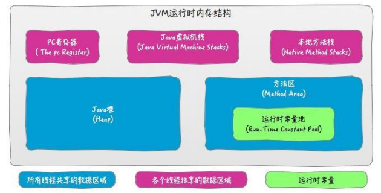
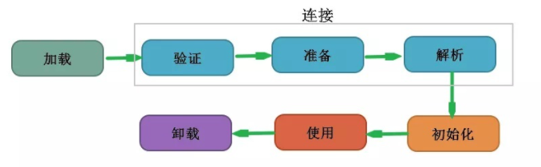

# Java虚拟机[[index]](https://github.com/Linkhhh/notes)

- [1. 内存](#1-内存TOP)
  - [1.1. 简述JVM的运行时数据区？各个存储区域有什么作用？](#11-简述JVM的运行时数据区各个存储区域有什么作用TOP)
  - [1.2. 简述对象实例化的过程？如何解决内存分配的并发问题？](#12-简述对象实例化的过程如何解决内存分配的并发问题TOP)
  - [1.3. 简述四种引用类型？有什么作用？应用场景？](#13-简述四种引用类型有什么作用应用场景TOP)
- [2. 垃圾回收](#2-垃圾回收TOP)
  - [2.1. 如何判断一个对象是否存活？](#21-如何判断一个对象是否存活TOP)
  - [2.2. 有哪些垃圾收集的方法？](#22-有哪些垃圾收集的方法TOP)
  - [2.3. 简述JVM内存分配策略？](#23-简述JVM内存分配策略TOP)
  - [2.4. 简述G1和CMS垃圾收集器？](#24-简述G1和CMS垃圾收集器TOP)
  - [2.5. 如何排查内存泄露（OOM）？](#25-如何排查内存泄露OOMTOP)
- [3. 类加载机制](#3-类加载机制TOP)
  - [3.1. 简述类加载过程？](#31-简述类加载过程TOP)
  - [3.2. 简述类加载器工作机制？什么是双亲委派机制？有什么好处？](#32-简述类加载器工作机制什么是双亲委派机制有什么好处TOP)
  - [3.3. 有哪些类加载器？](#33-有哪些类加载器TOP)
  - [3.4. 自定义类加载器怎么实现？如何才能不走双亲委派模型？](#34-自定义类加载器怎么实现如何才能不走双亲委派模型TOP)
- [4. 调优](#4-调优TOP)
  - [4.1. 有哪些命令可以查看JVM的状态、堆栈信息？有哪些常用参数？](#41-有哪些命令可以查看JVM的状态堆栈信息有哪些常用参数TOP)
  - [4.2. JVM如何设置栈的大小？](#42-JVM如何设置栈的大小TOP)

1. JVM性能调优的监控工具了解那些？

2. 简单谈谈JVM内存模型，以及volatile关键字

3. 垃圾收集器与内存分配策略

4. 你说你了解虚拟机，你知道虚拟机的运行时数据区吗？哪些是线程共享的，哪些是线程独有的？你了解 JVM 调优吗？调优过吗？为什么要这么设置？垃圾回收算法有几种？为什么要分代收集？Young 区说说它的分布结构，为什么 Eden 区 80%？为什么大对象直接进入老年代？控制的参数是什么？一个对象如果不是大对象，怎样才能进入老年代？控制的参数是什么？什么时候会发生 OOM？你遇到过吗？怎么解决的？为什么低版本的 JDK 要把永久代内存调大点？默认大小是多少你知道吗？什么是 Major GC，什么是 Minor GC？什么情况下会频繁 GC？你查看过 GC 日志吗？什么时候回收对象？引用计数和可达性分析是什么？为什么 Java 使用后者？Python 使用前者？什么是 GCRoot？什么类型的对象可以作为 GCRoot？什么时候对象不可达？Java 的四种引用说下，分别用在什么场景？你知道 JDK 源码哪里有用到 WeakReference 吗？什么是 STW？什么是 Safepoint？类加载的过程说下，什么时候优化，以及不同的阶段的主要优化是什么？解语法糖是什么时候？为什么在编译的时候解语法糖？什么是双亲委派模型？可以破坏吗？各个 ClassLoader 加载哪部分类的？你自定义过 ClassLoader 吗？你说你用过 Jstack 诊断 CPU 使用率飙升的情况，说下具体步骤？Arthas 用过吗？Class 文件格式说下，什么是魔数，Class 文件的魔数是什么？JMX 了解吗？生产上有碰到过虚拟机的问题吗？怎么解决的？

5. JVM垃圾回收，fullgc是否可以回收方法区

6. 3、fullgc的时候会导致接口的响应速度特别慢，如何排查和解决

7. 垃圾收集算法

8. 定义Integer x=20 Integer y=200 在内存里是个什么过程？

9. java内存泄漏?描述一下场景?

10. 什么时候触发minor GC 什么时候触发full GC

11. 25、请你说一下类加载过程？

12. 简单说一下JVM的垃圾回收？垃圾回收有哪些算法？标记-清除和标记-整理算法的原理、区别？

13. .如果web服务器突然出现频率很高的FullGC，可能是什么原因?你会怎么去排查呢？

14. 26、对象是如何实例化的？

15. .讲一讲类加载器工作机制？你知道强引用、弱引用和软引用吗?为什么要有这些东西？他们有什么作用？你在项目中用过吗？

16. Java的内存模型，分为哪几块存储区，各个存储区域的作用？说一说volatile，一般什么时候用这个，给我举个例子呗

17. 自己写的java应用条有过哪些JVM参数，为什么这么调优

18. 这个问住了，我只知道最大堆最小堆，开G1开GC日志以及OOM dumper这些基本的

19. 24、Java垃圾处理方法，如何GC？谈一谈内存划分的功能？JVM调优？

20. 19、Java是否有内存泄漏和溢出？工作中遇到过泄漏吗？怎么查内存泄漏？

21. 13.jvm的垃圾回收算法？

22. > 自定义类加载器怎么实现，其中哪个方法走双亲委派模型，哪个不走，不走的话怎么加载类（实现findclass方法，一般用defineclass加载外部类），如何才能不走双亲委派。（重写loadclass方法）

    > JVM 判断对象是否回收? 答案就是GC roots。也就是从根对象出发，没有任何一个对象引用到它，那么就判断这个对象是不可达的。 通常被骂“断子绝孙”的人，就是要被回收的root
    >
    > GCROOT 有哪些?
    >
    > ```
    > 1. 虚拟机栈（栈帧中的本地变量表）中引用的对象。
    > ```
    >
    > 1. 本地方法栈中JNI（即一般说的native方法）引用的对象。
    > 2. 方法区中的静态变量和常量引用的对象。
    > 3. 活跃线程的引用对象
    >
    > 所以不要让他们过度繁殖。
    >
    > 是否有过JVM调优

23. 3.对Java的垃圾回收机制了解吗？垃圾回收器呢？说一下CMS？OOM的排查思路？

24. JVM内存模型 G1和CMS垃圾回收器

25. JVM垃圾回收机制以及四大算法优化策略是如何实现的,新生代和老年代

26. 说一下gc

27. 讲讲对JVM的理解，讲了GC

28. jstate是否使用， 如何查看线上内存是否泄漏；

29. Java应用启动时可以选择哪些GC,cms的原理

30. 描述下JVM内存模型。每个区的作用是什么？堆内存的工作原理，为什么需要两个幸存区？只有一个行不行？老生代是用什么垃圾回收算法？

31. 类加载机制

32. 类的生命周期

33. JVM组成

34. 分析操作数栈和局部变量表

35. 1、什么是值传递和引用传递?

36. 5、Java 8 内存模型进行了哪些改进?

37. 15、如和判断一个对象是否存活?(或者GC对象的判定方法)?

38. 16、Java类的实例化顺序?

39. 9、简述java内存分配与回收策率以及Minor GC和Major GC?

40. 、描述类加载器工作机制?

41. java中垃圾收集的方法有哪些?

42. 类加载器有哪些?

43. 描述Java内存模型?

44. java虚拟机GC算法

45. 3.描述下JVM内存模型。每个区的作用是什么？堆内存的工作原理，为什么需要两个幸存区？只有一个行不行？老生代是用什么垃圾回收算法？

46. 1.jvm底层原理和排查命令

47. Java虚拟机的内存模型------建议直接上草图和面试官聊……

48. 谈谈虚拟机创建对象的过程------虚拟机获取到new指令后能否在常量池中定位到一个类的符号引用，并检测是否被加载和初始化，然后为新生对象分配空间并初始化，设置对象头……

49. 虚拟机创建对象会出现并发问题吗？----------说实话国内作为业务为主的程序员实际不用关注虚拟机（产品）的并发问题，这是老外升级或发布产品该考虑的事。给对象A分配内存时指针还没来的及修改，对象B又使用该指针来分配内存，所以会出现并发问题，至于怎么规避……我不晓得。

50. 内存溢出一般发生在哪个区？永久代会不会导致内存溢出？------Java堆溢出，创建对象回收不及时肯定会导致。本地方法栈溢出，线程请求的空间大于虚拟机能够提供的空间或者虚拟机扩展栈大于物理机空间。方法区JDK1.7逐渐取代了所谓的永久代之说……具体的也说不清楚了。。。 栈溢出一般抛出什么异常？jvm设置栈的大小，参数？--------线程请求的栈大于虚拟机允许的容量抛出StackOverflowError异常，虚拟机扩展栈时受制于物理机的限制会抛出OutOfMemoryError异常。-Xss虚拟机参数…… JVM的垃圾回收机制-----个人认为从三点来回答：那些内存需要回收？什么时候回收？怎么回收？一般来说垃圾收集器关注的主要是堆中的对象生命周期的动态变化，首先判断该对象的存活与否，生命周期耗尽的对象给予回收…… 用过哪些命令查看JVM的状态、堆栈信息？--------jps命令，jstat命令，jmap内存映像工具……

51. Java的类加载机制？自定义类加载器的实现？------虚拟机把描述类的数据从Class文件加载到内存，并对数据进行校验、转换解析和初始化，最终形成可以被虚拟机直接使用的Java类型。每个类都需要由加载它的类加载器和该类本身一起确立在Java虚拟机的唯一性，类加载器都拥有一个独立的类名称空间。比较类的相等必须在同一个类加载器下比较才有意义……

## 1. 内存[[TOP]](#Java虚拟机)

### 1.1. 简述JVM的运行时数据区？各个存储区域有什么作用？[[TOP]](#Java虚拟机)



**程序计数器（线程私有）** 

​		记录线程执行虚拟机字节码指令的位置，确保线程切换后能恢复到正确的执行位置。 

**虚拟机栈（线程私有）** 

​		java方法执行的内存模型，每个方法在执行的时候都会创建一个栈帧（局部变量表、操作数栈、动态连接、方法出口），每一个方法被调用直至执行完毕的过程，就对应着一个栈帧在虚拟机栈中从入栈到出栈的过程，如果线程请求的栈深度大于虚拟机所允许的深度，将抛出`StackOverflowError`异常。


局部变量表包含了三部分： 

- 基本数据类型（boolean、byte、char、short、int、 float、long、 double）；

- 对象引用（reference类型，它并不等同于对象本身，可能是一个指向对象起始地址的引用指针，也可能是指向一个代表对象的句柄或者其他与此对象相关 的位置） ；

- returnAddress类型（指向了一条字节码指令的地址）。


**本地方法栈（线程私有）** 

​		本地方法栈对应Native方法。如果线程请求的栈深度大于虚拟机所允许的深度，将抛出`StackOverflowError`异常。 

**堆（线程共有）** 

​		存放所有的对象实例。如果在Java堆中没有内存完成实例分配，并且堆也无法再扩展时，Java虚拟机将会抛出`OutOfMemoryError`异常。

 **方法区（线程共有）** 

​		存储已被虚拟机加载的类型信息、常量、静态变量、即时编译器编译后的代码缓存等数 据。如果方法区无法满足新的内存分配需求时，将抛出`OutOfMemoryError`异常。

**运行时常量池（方法区）**

​		是方法区的一部分。用于存放Class文件编译期生成的各种字面量与符号引用，这部分 内容将在类加载后存放到方法区的运行时常量池中。当常量池无法再申请到内存 时会抛出 `OutOfMemoryError`异常。 

**直接内存（堆外内存）** 

​		NIO可以使用Native函数库直接分配堆外内存，然后通过一个存储在Java堆里面的DirectByteBuffer对象作为这块内存的引用进行操作。这样可以避免了在Java堆和Native堆 中来回复制数据。 堆外内存不受受到Java堆大小的限制，但各个内存区域总和大于物理内存限制（包括物理的和操作系统级的限制），也会导致动态扩展时出现`OutOfMemoryError`异常。

### 1.2. 简述对象实例化的过程？如何解决内存分配的并发问题？[[TOP]](#Java虚拟机)

1. Java虚拟机遇到一条字节码new指令，检查这个指令的参数是否能在常量池中定位到一个类的符号引用，以及这个符号引用代表的类是否已被加载、解析和初始化 过。如果没有，先执行相应的类加载过程。 
2. 为新生对象分配内存，有以下两种方式： 
   1. 指针碰撞（所有被使用过的内存都被放在一 边，空闲的内存被放在另一边，中间放着一个指针作为分界点的指示器，分配内存 就仅仅是把指针向空闲空间方向挪动一段与对象大小相等的距 离），该方式要求内存规整，其垃圾收集器带有空间压缩整理能 力。 
   2. 空闲列表（维护一个记录上哪些内存块是可用的列表，在分 配的时候从列表中找到一块足够大的空间划分给对象实例，并更新 列表上的记录），该方式内存不规整，其垃圾收集器基于`CMS`清除算法。 
   3. 线程安全的解决办法： 
      1. CAS配上失败重试的方式保证原子性 ;
      2. 为每个线程在java堆中预分配一小块内存 （本地线程分配缓冲），用完后分配新的缓存区时采取同步锁定。  
3. 初始化分配的内存空间（但不包括对象头）为零值，保证对象的实例字段在 Java代码中可以不赋初始值就直接使用，使程序能访问到这些字段的数据类型所对应 的零值。 
4. 对象进行必要的设置（是哪个类的实例、如何定位类的元数据信息、对象的哈 希码、对象的GC分代年龄等信息。是否启用偏向锁等）。
5. 执行构造函数。

### 1.3. 简述四种引用类型？有什么作用？应用场景？[[TOP]](#Java虚拟机)

- **强引用**

  ​		即类似`Object obj=new Object()`这种引用关系。无论任何情况下，只要强引用关系还存在，垃圾收集器就永远不会回收掉被引用的对象。

- **软引用**

  ​		描述非必须的对象。在系统将要发生内存溢出异常前，会把这些对象列进回收范围之中进行第二次回收，如果这次回收还没有足够的内存， 才会抛出内存溢出异常。 

  > 适合作为缓存使用。

- **弱引用**

  ​		描述非必须对象，强度比软引用更弱一些，被弱引用关联的对象只能生存到下一次垃圾收集发生为止。当垃圾收集器开始工作，无论当前内存是否足够，都会回收掉只被弱引用关联的对象。 

  > ThreadLocal内部使用了弱引用，用来保证那些不被用到的key值在垃圾回收的时候可以被回收掉。
  >
  > 如果一个对象是偶尔（很少）的使用，并且希望在使用时随时就能获取到，但又不想影响此对象的垃圾收集，可以使用弱引用。

- **虚引用**

  ​		一个对象是否有虚引用的存在，完全不会对其生存时间构成影响， 也无法通过虚引用来取得一个对象实例。虚引用唯一目的只是为了能在这个对象被收集器回收时收到一个系统通知。

  > 用来跟踪对象被垃圾回收器回收的活动。
  >
  > Java堆中保存的直接内存的引用，就是虚引用的使用场景，在垃圾回收虚引用关联的内存的时候，虚引用关联的直接内存，会收到内存被回收的信息，进而对直接内存进行清理工作。

## 2. 垃圾回收[[TOP]](#Java虚拟机)

### 2.1. 如何判断一个对象是否存活？[[TOP]](#Java虚拟机)

- **引用计数法**

  ​		给每个对象添加一个计数器，当有地方引用该对象时计数器加1，当引用失效时计数器减1。用对象计数器是否为0来判断对象是否可被回收。

  > 无法解决循环引用的问题。

- **可达性分析算法**

  ​		通过`GC ROOT`的对象作为搜索起始点，通过引用向下搜索，所走过的路径称为引用链。当一个对象到`GC ROOT`没有任何的引用链相连时，证明此对象可被回收。

### 2.2. 有哪些垃圾收集的方法？[[TOP]](#Java虚拟机)

- **标记-清除算法**

  ​		标记清除算法主要过程是把内存区域中的待回收的对象进行标记，然后清理掉。

  > 标记清除算法会出现内存碎片，即清除后内存会被分成很多块，无法再次使用。

- **复制算法**

  ​		复制算法将可用内存按容量划分为大小相等的两块，每次只使用其中的一块。当这一块的内存用完了，就将还存活着的对象复制到另外一块上面，然后再把已使用过的内存空间一次清理掉。保证了内存的连续可用。

  > 复制算法的实际使用容量为总容量的两倍。

- **标记-整理算法**

  标记-整理算法标记将所有存活的对象都向一端移动，再清理掉存活的对象边界以外的内存区域。

  > 标记整理算法对内存变动更频繁，需要整理所有存活对象的引用地址，在效率上差很多。

- **分代收集算法**

  分代收集算法根据对象存活周期的不同将内存划分为几块，然后对不同的区域采用不同的垃圾回收算法。

  > 在新生代中，每次垃圾收集时都发现有大批对象死去，只有少量存活，就选用复制算法，只需要付出少量存活对象的复制成本就可以完成收集。
  >
  > 在老年代中，因为对象存活率高、没有额外空间对它进行分配担保，就必须使用标记-清理算法或者标记-整理算法来进行回收。

### 2.3. 简述JVM内存分配策略？[[TOP]](#Java虚拟机)

​		Java 虚拟机根据对象存活的周期不同，把堆内存划分为分为新生代（新生代又分为`Eden`区、`From`区、`To`区，比例为`8:1:1`）、老年代。

- 绝大多数刚刚被创建的对象会存放在`Eden`区。
- 当`Eden`区第一次满的时候，会进行`Young GC`。首先将`Eden`区的垃圾对象回收清除，并将存活的对象复制到 `From`区，此时`Eden`区是空的。
- 当下一次 `Eden` 区满的时候，再执行一次`Young GC`。此次会将`Eden`区和`From`区中所有垃圾对象清除，并将存活对象复制到`To`区，此时`Eden`区和`From`区变为空。
- 当下一次 `Eden` 区满的时候，再执行一次`Young GC`。此次会将`Eden`区和`To`区中所有垃圾对象清除，并将存活对象复制到`From`区，此时`Eden`区和`To`区变为空。
- 如此反复在 `From` 和 `To` 之间切换几次（默认 15 次）之后，如果还有存活对象。说明这些对象的生命周期较长，则将它们转移到老年代中。
- 当老年代空间用完时，将进行`Full GC`。

### 2.4. 简述G1和CMS垃圾收集器？[[TOP]](#Java虚拟机)

**CMS垃圾收集器**

​		CMS垃圾收集器是一款并发的、使用标记-清除算法针对老年代垃圾回收的垃圾回收器，在初始化阶段会导致STW。CMS垃圾回收过程：

1. 初始化标记，标记root，会导致STW；
2. 并发标记，与用户线程同时运行；
3. 预清理，与用户线程同时运行；
4. 重新标记，会导致STW；
5. 并发清除，与用户线程同时运行；
6. 调整堆大小，设置CMS在清理之后进行内存压缩，目的是清理内存中的碎片；
7. 并发重置状态等待下次CMS的触发，与用户线程同时运行；

**G1垃圾收集器**


### 2.5. 如何排查内存泄露（OOM）？[[TOP]](#Java虚拟机)

## 3. 类加载机制[[TOP]](#Java虚拟机)

### 3.1. 简述类加载过程？[[TOP]](#Java虚拟机)



1. **加载**：把class字节码文件载入到虚拟机中。
   - 通过类的全限定名来获取定义此类的二进制字节流；
   - 将此二进制字节流所代表的静态存储结构转化成方法区的运行时数据结构；
   - 在内存中生成代表此类的`java.lang.Class`对象,作为该类访问入口。
   
2. **验证**：验证的目的是确保class文件的字节流中信息符合虚拟机的要求，不会危害虚拟机安全，使得虚拟机免受恶意代码的攻击。
   - 文件格式验证；
   - 源数据验证；
   - 字节码验证；
   - 符号引用验证。
   
3. **准备**：为类的静态变量分配内存并设为默认的初值（仅包含类变量,不包含实例变量），对于非静态的变量，则不会为它们分配内存。

4. **解析**：将常量池中的符号引用替换为直接引用，解析动作主要针对类或接口，字段，类方法，方法类型等等。

5. **初始化**：执行类中定义的java程序代码，该阶段会执行类构造器，在下面5种情况下必须对类进行初始化：
   - 遇到`new`、`getstatic`、`putstatic`、`invokestatic`这4条字节码指令时，如果类没有进行过初始化，则需要先触发其初始化。
   - 使用`java.long.reflect`包的方法对类进行反射调用的时候，如果类没有进行过初始化，则需要先触发其初始化。
   - 当初始化一个类的时候，如果发现其父类没有进行过初始化，则需要先触发其父类的初始化。
   - 当虚拟机启动时，需要制定一个执行的主类（即main方法的类），虚拟机必须先初始化这个类。
   - 使用动态语言支持时，如果一个`java.lang.invoke.MethodHandle`实例最后解析结果是`REF_getStatic`、`REF_putStatic`、`REF_invokeStatic`的方法句柄，并且这个方法句柄对应的类没有进行初始化，则需要先触发其初始化。
   
6. **使用**：使用该类所提供的功能，其中包括主动引用和被动引用。

7. **卸载**：从内存中释放，当类满足以下条件时将被回收：
   - 该类所有的实例都已经被回收，也就是Java堆中不存在该类的任何实例；
   - 加载该类的`ClassLoader`已经被回收；
   - 该类对应的`java.lang.Class`对象没有在任何地方被引用，无法在任何地方通过反射访问该类的方法。

### 3.2. 简述类加载器工作机制？什么是双亲委派机制？有什么好处？[[TOP]](#Java虚拟机)

- **全盘负责**

  ​		当一个类加载器负责加载某个Class时，该Class所依赖和引用其他Class也将由该类加载器负责载入，除非显示使用另外一个类加载器来载入。

- **双亲委派**

  ​		如果一个类加载器收到了类加载请求，它并不会自己先去加载，而是把这个请求委托给父类的加载器去执行，如果父类加载器还存在其父类加载器，则进一步向上委托，依次递归，请求最终将到达顶层的启动类加载器，如果父类加载器可以完成类加载任务，就成功返回，倘若父类加载器无法完成此加载任务，子加载器才会尝试自己去加载，这就是双亲委派模式。

  > 采用双亲委派模式的好处：
  >
  > - 避免类的重复加载：当父类加载器已经加载了该类时，就没有必要子类加载器再加载一次。
  > - 安全：假设通过网络传递一个名为`java.lang.Integer`的类，通过双亲委托模式传递到启动类加载器，而启动类加载器在核心JDK库中该类已被加载，并不会重新加载网络传递的过来的`java.lang.Integer`，这样便可以防止JDK库被随意篡改。

- **缓存机制**

  ​		缓存机制将会保证所有加载过的Class都会被缓存，当程序中需要使用某个Class时，类加载器先从缓存区中搜寻该Class，只有当缓存区中不存在该Class对象时，系统才会读取该类对应的二进制数据，并将其转换成Class对象，存入缓冲区中。

### 3.3. 有哪些类加载器？[[TOP]](#Java虚拟机)

1. 启动类加载器：主要负责加载JAVA中的一些核心类库，主要是位于`<JAVA_HOME>/lib/rt.jar`中。
2. 拓展类加载器：主要加载JAVA中的一些拓展类，位于`<JAVA_HOME>/lib/ext`中,是启动类加载器的子类。
3. 应用类加载器：又称为系统类加载器,主要用于加载`CLASSPATH`路径下我们自己写的类。

### 3.4. 自定义类加载器怎么实现？如何才能不走双亲委派模型？[[TOP]](#Java虚拟机)

**自定义类加载器的实现**

- 新建一个类继承自`java.lang.ClassLoader`重写它的`findClass`方法；
- 将class字节码数组转换为Class类的实例；
- 调用`loadClass`方法。

> 自定义类加载器重写`loadclass`方法可以不走双亲委派模型。

## 4. 调优[[TOP]](#Java虚拟机)

### 4.1. 有哪些命令可以查看JVM的状态、堆栈信息？有哪些常用参数？[[TOP]](#Java虚拟机)

- **jps（虚拟机进程状况工具）**

  ​		主要用来输出JVM中运行的进程状态信息。

  ```bash
  jps -q //只显示pid，不显示class名称,jar文件名和传递给main方法的参数
  jps -m //输出传递给main方法的参数，在嵌入式jvm上可能是null
  jps -l //输出应用程序main class的完整package名或者应用程序的jar文件完整路径名
  jps -v //输出传递给JVM的参数
  ```

- **jstack（堆栈跟踪工具）**

  ​		用于生成虚拟机当前时刻的线程快照。

- **jstat（虚拟机统计信息监控工具）**

  ​		监视虚拟机各种运行状态信息，可以显示本地或者是远程虚拟机进程中的类装载、内存、垃圾收集、JIT编译等运行数据。

- **jmap（生成虚拟机的内存转储快照）**

  ​		用于生成堆转存的快照，一般是heapdump或者dump文件。它可以查询finalize执行队列，java堆和永久代的详细信息，如空间使用率，当前用的哪种收集器

### 4.2. JVM如何设置栈的大小？[[TOP]](#Java虚拟机)

```java
-Xss
```

